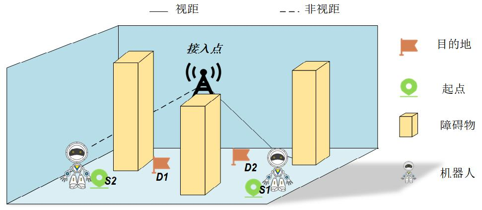

# Graduation Project

Title: Communication–Perception Collaborative Navigation and Trajectory Planning 
Algorithms for Multi-Robot Systems

## 1 Project describtion
To run the project, download the requirements first:
pip install -m requirements

TODO: Fill this part

## 2 System modeling

### 2.1 System describtion

Fig. 1-1: System model

As depicted in the system model of Figure 1-1, 
this indoor robot system comprises an access point equipped with 
**N antennas** and **K single-antenna robots**, 
where the set of robots is denoted as 
($ k \in \mathcal{K} = \{1,2,\dots,K\} $), 
and a number of obstacles are positioned within the model.

Establish a three-dimensional coordinate system as shown in the figure.
t represents the time step of the robot from the starting point to the ending point.
In this projection, $t \in \{1,2,...,T_k\}$, 
access point coordinates is **$q_{AP}=(x_{AP},y_{AP},z_{AP})$**, 
robots k's coordinates in time step t is **$q_{k}=(x_{k},y_{k},z_{k})$**.

### 2.2 Channel model

This work primarily focuses on channel models for indoor factory scenarios. 3GPP classifies scenarios into four categories based on standards such as base station height, room size, and machine density. For the analysis in this work, the channel model selects the "Sparse clutter Low BS (SL)" scenario to better understand and study wireless communication problems in industrial environments.

In the downlink transmission channel, the channel coefficient from the access point to the $k$-th robot at time $t$ can be expressed as:

$$h_k(t) = PL_k(t) - 10\log_{10}(g_k(t))$$

where $PL_k$ represents the path loss, and $g_k(t)$ represents the small-scale fading following a random Rayleigh distribution.

In 5G systems, there are two widely used path loss models, one of which is the ABG model. The formula for the ABG model is:

$$PL_{ABG}(f_c, d) = 10\alpha \log_{10}(d/d_0) + \beta + 10\gamma \log_{10}(f_c/f_0) + X_{ABG} \quad \text{(Eq. 2-1)}$$

The parameters in the formula are:
- $\alpha$ is the distance-dependent exponent
- $\beta$ is the intercept
- $\gamma$ is the frequency-dependent exponent
- $X_{ABG}$ is the shadow fading following a zero-mean normal distribution, with standard deviation denoted by $\sigma$

This work focuses on a typical indoor scenario, in which case the ABG model evolves into a floating intercept model.

In the SL (Sparse clutter Low BS) scenario, the model considers both Line-of-Sight (LOS) and Non-Line-of-Sight (NLOS) links. Setting $f_c = 3.5\text{GHz}$ and $d$ as the distance from the access point to the robot, the specific path loss formulas for the ABG model in the SL scenario are:

$$PL_{LOS}(f_c, d) = 31.84 + 21.50\log_{10}(d) + 19.00\log_{10}(f_c) \quad \text{(Eq. 2-2)}$$

$$PL_{SL}(f_c, d) = 33 + 25.50\log_{10}(d) + 20\log_{10}(f_c) \quad \text{(Eq. 2-3)}$$

$$PL_{NLOS} = \max(PL_{SL}, PL_{LOS}) \quad \text{(Eq. 2-4)}$$

Based on the above large-scale transmission model, the channel vector from the access point to the $k$-th robot is expressed as:

$$\tilde{h}_k(t) = \beta_k(t)(\alpha_k^{\text{transmit}})^H, \quad \forall k,t \quad \text{(Eq. 2-5)}$$

where the expression for $\alpha_k^{\text{transmit}}$ is:

$$\alpha_k^{\text{transmit}} = \frac{1}{\sqrt{N_t}} \left[1, e^{-j(2\pi D/\lambda)\sin\theta}, \ldots, e^{-j(2\pi D/\lambda)(N_t-1)\sin\theta}\right]^T \quad \text{(Eq. 2-6)}$$

Parameter descriptions:
- Its dimension is $1 \times N_t$
- $\beta_k(t) = 10^{-h_k(t)/20}, \forall t$ represents the path loss from the access point to the $k$-th robot
- $\lambda$ is the antenna wavelength
- In the formula, $D$ is the distance between antennas, set to $\lambda/2$

### 2.3 Communication model

#### 2.3.1 Non-Orthogonal Multiple Access Scheme

To implement the NOMA scheme, the base station groups the $K$ robots based on their channel conditions. The grouping strategy is as follows:

First, the base station collects the channel state information (CSI) of all $K$ robots. Then, the robots are sorted in descending order according to the squared magnitude of their complex channel coefficients $|h_k|^2$.

The robots are paired into groups using the following pairing rule: the robot ranked $m$-th is paired with the robot ranked $(K/2 + m)$-th to form a group. This pairing process continues until $K/2$ groups are formed.

If $K$ is odd, there will be one unpaired robot that forms a group by itself, and the grouping logic remains the same. However, in this work, $K$ is assumed to be even by default.

#### 2.3.2 Diagonalization precoding for inter-cluster interference cancellation

To mitigate inter-cluster interference, diagonalization precoding is employed. The core idea is to design precoding matrices that lie in the null space of the interfering channels, thereby preventing interference to other clusters while transmitting to the desired cluster.

Consider a system with $M$ clusters (as described in Section 2.3.1, where two users form a cluster, and there are $M$ such clusters). For a specific cluster $m$, its precoding matrix $\mathbf{w}_m$ must satisfy the following condition to cancel interference directed towards other clusters:

$$\tilde{\mathbf{H}}_{m,i} \mathbf{w}_m = \mathbf{0} \quad \text{(Eq. 2-7)}$$

Here, $\mathbf{H}_{m,i} = [\mathbf{h}_1, \dots, \mathbf{h}_M]$ represents an aggregated channel matrix. $\tilde{\mathbf{H}}_{m,i}$ is the submatrix obtained by removing the column corresponding to cluster $m$ from $\mathbf{H}_{m,i}$. This $\tilde{\mathbf{H}}_{m,i}$ therefore represents the aggregate channel vectors of all interfering clusters. Its dimension is $N_t \times (M-1)$, where $N_t$ is the number of transmit antennas.

To find the appropriate precoding matrix $\mathbf{w}_m$, Singular Value Decomposition (SVD) is performed on $\tilde{\mathbf{H}}_{m,i}$:

$$\tilde{\mathbf{H}}_{m,i} = \tilde{\mathbf{U}}_m \mathbf{\Sigma}_m [\tilde{\mathbf{V}}_m^{(1)} \quad \tilde{\mathbf{V}}_m^{(0)}]^H \quad \text{(Eq. 2-8)}$$

In this decomposition:
- $\tilde{\mathbf{U}}_m$ is the left singular matrix
- $\mathbf{\Sigma}_m$ is the diagonal matrix containing singular values
- $[\tilde{\mathbf{V}}_m^{(1)} \quad \tilde{\mathbf{V}}_m^{(0)}]$ is the right singular matrix, partitioned into two sub-matrices

Specifically:
- $\tilde{\mathbf{V}}_m^{(1)}$ comprises the first $N_m$ columns of the right singular matrix. These columns represent the transmission directions of signals that are correlated with the known interfering channel information. Here, $N_m$ denotes the effective rank or the number of significant interfering dimensions of $\tilde{\mathbf{H}}_{m,i}$
- $\tilde{\mathbf{V}}_m^{(0)}$ comprises the remaining columns of the right singular matrix. These columns span the null space of $\tilde{\mathbf{H}}_{m,i}$, describing transmission directions that are uncorrelated with the known interfering channel information. Signals transmitted along these directions will not cause interference to the other clusters represented by $\tilde{\mathbf{H}}_{m,i}$

For a non-empty null space (i.e., for $\tilde{\mathbf{V}}_m^{(0)}$ to have a non-zero dimension), the total number of transmit antennas $N_t$ must be greater than the effective number of receive antennas (or rank) of the interfering channels, $N_m$.

The equivalent channel undergoes SVD decomposition again:

$$\mathbf{H}_{m,i} \tilde{\mathbf{V}}_m^{(0)} = \tilde{\mathbf{U}}_{m,i} \mathbf{\Sigma}_m [\tilde{\mathbf{V}}_m^{(1)} \quad \tilde{\mathbf{V}}_m^{(0)}]^H \quad \text{(Eq. 2-9)}$$

where $\tilde{\mathbf{V}}_m^{(1)}$ consists of the first $N_m$ columns of the right singular matrix of this equivalent channel. The precoding matrix is then:

$$\mathbf{w}_m = \mathbf{V}_m^{(1)} \tilde{\mathbf{V}}_m^{(0)} \quad \text{(Eq. 2-10)}$$

This precoding matrix $\mathbf{w}_m$ is designed to mitigate interference among the robots, facilitating effective communication.

#### 2.3.3 Successive Interference Cancellation

Based on the power-domain NOMA transmission scheme, $P_{m,1}$ and $P_{m,2}$ are the allocated powers for each signal in each cluster. After transmission through the Rayleigh channel, the signal for each cluster can be written as:

$$\begin{bmatrix} \mathbf{y}_{m,1} \\ \mathbf{y}_{m,2} \end{bmatrix} = \begin{bmatrix} \mathbf{h}_{m,1} \\ \mathbf{h}_{m,2} \end{bmatrix} \mathbf{w}_m \mathbf{s}_m + \begin{bmatrix} \mathbf{n}_{m,1} \\ \mathbf{n}_{m,2} \end{bmatrix} \quad \text{(Eq. 2-11)}$$

where $\mathbf{y}_{m,1}$ and $\mathbf{y}_{m,2}$ represent the received baseband signals at robot 1 and robot 2, respectively, within cluster $m$; $\mathbf{h}_{m,1}$ and $\mathbf{h}_{m,2}$ are the channel vectors from the access point to robot 1 and robot 2 in cluster $m$; $\mathbf{w}_m$ is the precoding matrix for cluster $m$; $\mathbf{s}_m = \sqrt{P_{m,1}} x_{m,1} + \sqrt{P_{m,2}} x_{m,2}$ is the superimposed NOMA signal for cluster $m$, where $x_{m,1}$ and $x_{m,2}$ are the data streams for the two robots; and $\mathbf{n}_{m,1}$ and $\mathbf{n}_{m,2}$ represent the additive white Gaussian noise (AWGN) at the receivers.

In this system, the access point needs to appropriately select the transmit power to perform correct SIC decoding. Robots with weaker channel conditions need to be allocated greater transmit power, but must satisfy $P_{m,2}(t)\beta_{m,1}(t) - P_{m,1}(t)\beta_{m,1}(t) \geq \rho_{\min}$, where $\rho_{\min}$ is the minimum power difference required to perform SIC. After completing SIC, the Signal-to-Interference-plus-Noise Ratio (SINR) for the first robot (typically the stronger user) in cluster $m$ is:

$$SINR_{m,1} = \frac{P_{m,1} |\mathbf{h}_{m,1} \mathbf{w}_m|^2}{\sigma^2} \quad \text{(Eq. 2-12)}$$

For the second robot (typically the weaker user) in cluster $m$, the SINR is:

$$SINR_{m,2} = \frac{P_{m,2}|\mathbf{h}_{m,2}\mathbf{w}_m|^2}{P_{m,1}|\mathbf{h}_{m,2}\mathbf{w}_m|^2 + \sigma^2} \quad \text{(Eq. 2-13)}$$

In URLLC, short packet transmission is adopted to reduce delay, making the traditional Shannon capacity formula no longer applicable. The achievable data rate under finite blocklength becomes a complex expression concerning decoding error probability and blocklength. The decoding error probability for robot $i$ in cluster $m$ at time $t$ is:

$$\epsilon_{m,i}(t) = Q\left(\ln 2 \sqrt{\frac{N}{V}}\left(\log_2(1+SINR_{m,i})-\frac{D}{N}\right)\right) \quad \text{(Eq. 2-14)}$$

where $Q(\xi)$ is the Q-function defined as:

$$Q(\xi) = \frac{1}{\sqrt{2\pi}}\int_{\xi}^{\infty}e^{-\frac{t^2}{2}}dt \quad \text{(Eq. 2-15)}$$

and $V$ is the channel dispersion given by:

$$V = 1-(1+SINR_{m,i}(t))^{-2} \quad \text{(Eq. 2-16)}$$

Here, $N$ is the channel block length, $D$ is the data packet size, and $V$ is the channel dispersion. Since this work adopts SIC technology in its analysis, the error rates among robots are mutually influenced. This work mainly considers the error rate situation for robots with poorer channel conditions.
