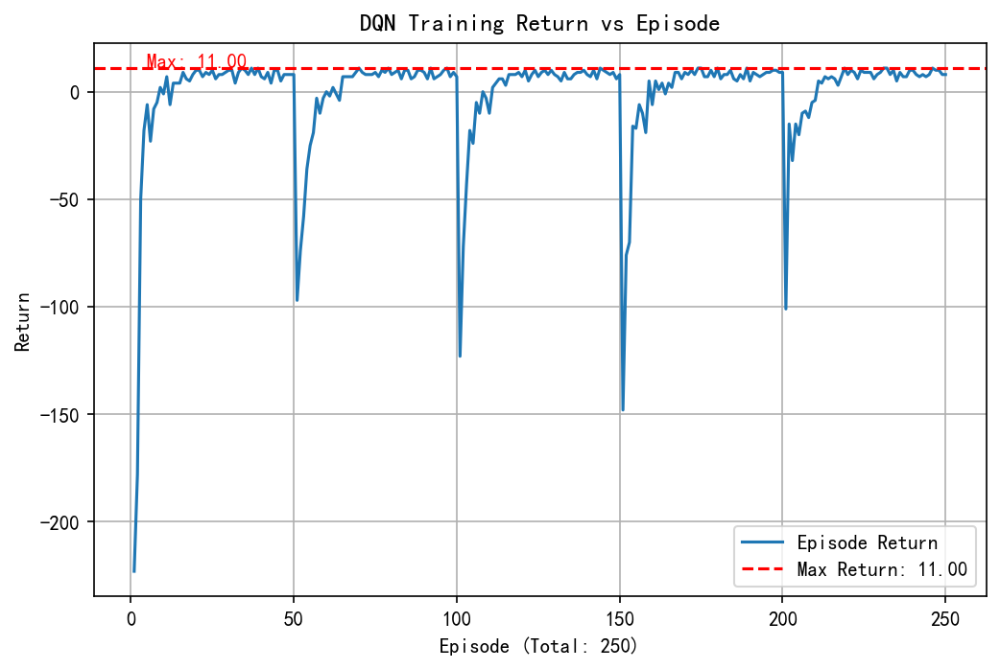
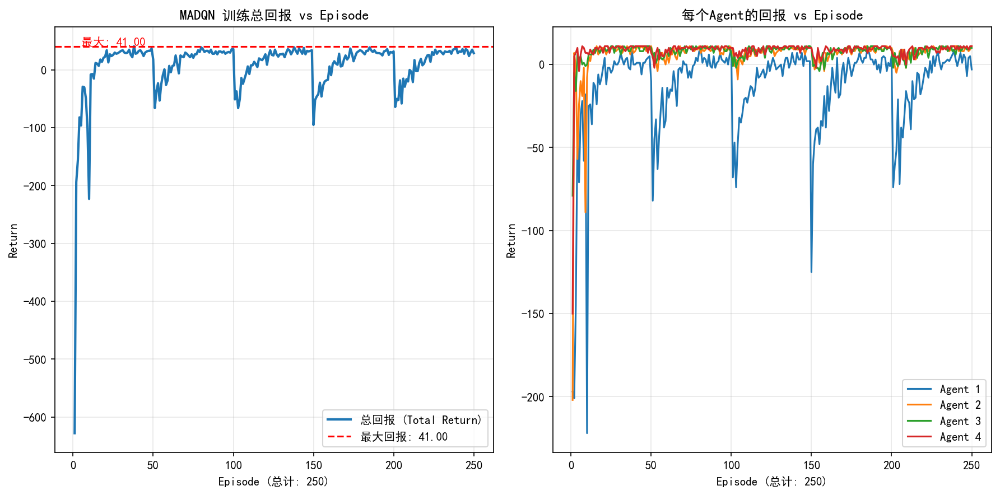
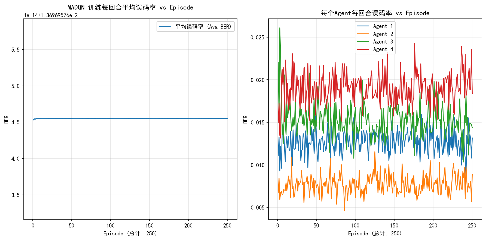
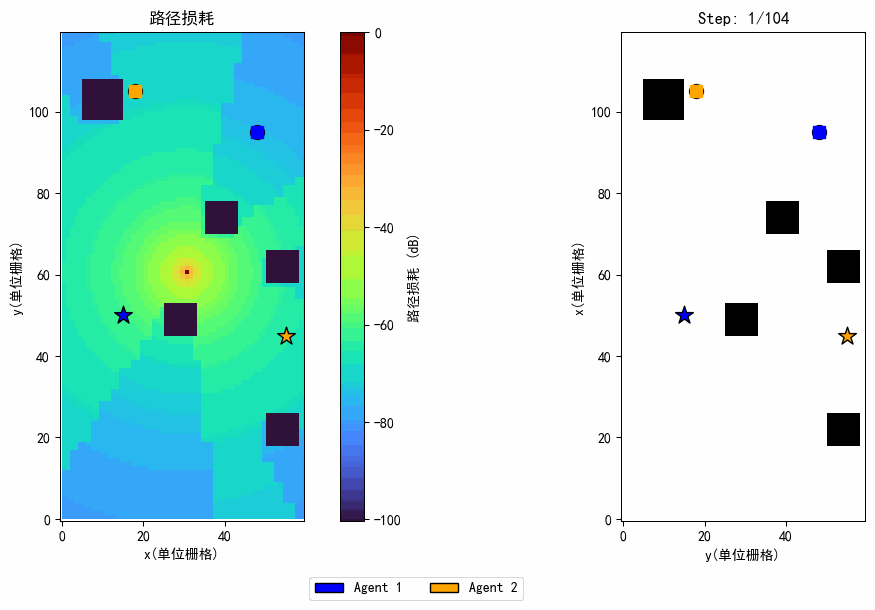
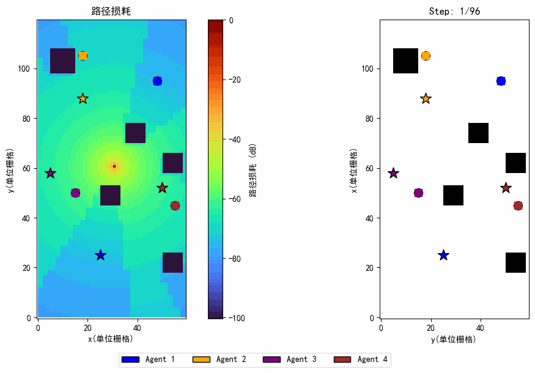
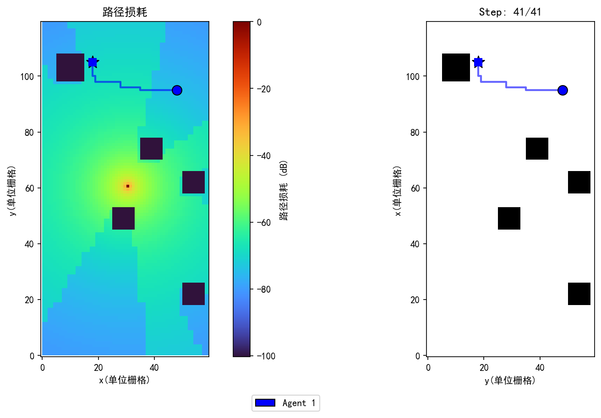
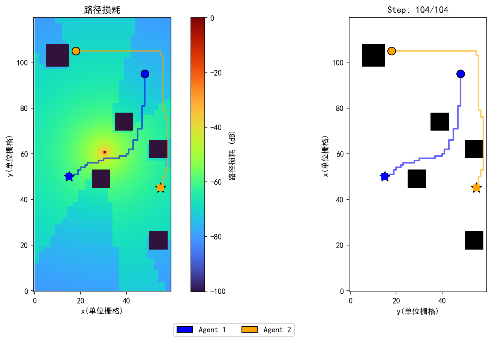
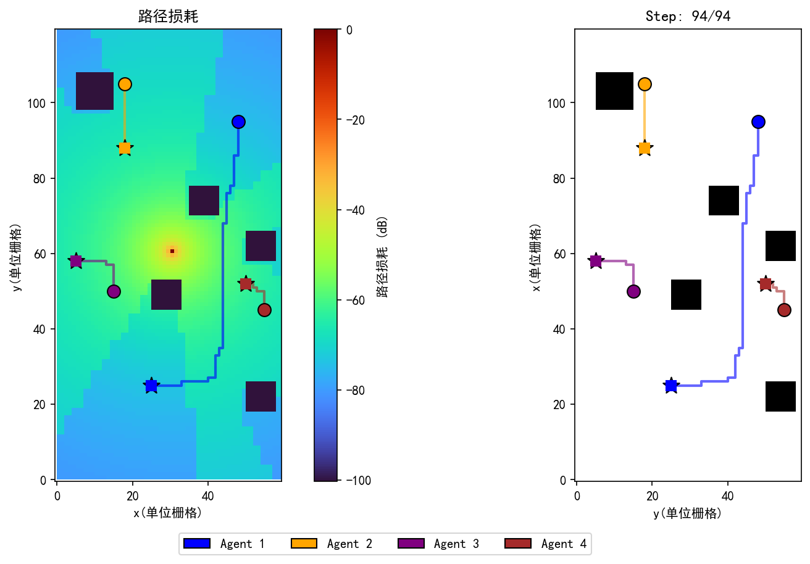

# 毕业设计

**题目：** 多机器人系统通信–感知协同导航与轨迹规划算法

---

## 1 项目说明

### 1.1 环境配置

安装依赖：

```bash
pip install -r requirements.txt
```

### 1.2 算法

本项目在通信感知多机器人场景下实现了两种强化学习（RL）导航算法。

- **DQN（深度 Q 网络）**  
  单智能体导航。智能体通过以**状态**和**目标**为输入的神经网络进行 Q 学习：\(Q(s, a \mid \text{target})\)。网络使用状态嵌入、目标嵌入及相对位置（到目标的距离/方向）。训练采用经验回放、目标 Q 网络和 \(\varepsilon\)-贪心探索。奖励可包含通信质量（如 NOMA/SIC 模型得到的 BER）。

- **MADQN（多智能体 DQN）**  
  多机器人导航，每个机器人拥有独立 Q 网络与经验回放。所有智能体并行决策，各自朝目标移动。每个智能体采用相同的 TD 学习与目标网络更新。环境奖励可包含基于 SIC 的 BER，从而在到达目标与保持链路质量之间优化轨迹。

### 1.3 运行方法

请在项目根目录下执行以下命令。

#### 训练

```bash
# 训练 DQN（单智能体）
python main.py --model dqn --mode train

# 训练 MADQN（多智能体）
python main.py --model madqn --mode train
```

**训练结果与日志保存位置：**

| 输出内容 | 保存路径 |
|----------|----------|
| 模型权重 | `models/dqn_model.pth`、`models/madqn_model.pth` |
| 训练曲线图 | `rl_algorithms/plot/figs/`（如 `dqn_return.png`、`madqn_return.png`、`madqn_ber.png`）。可复制到 `results/Train/` 用于展示。 |
| 训练日志（MADQN） | `logs/`（如 `madqn_YYYYMMDD_HHMM.log`） |

#### 测试

```bash
# 测试 DQN（默认加载 models/dqn_model.pth）
python main.py --model dqn --mode test [--model_path 路径] [--max_steps 步数] [--quiet]

# 测试 MADQN（默认加载 models/madqn_model.pth）
python main.py --model madqn --mode test [--model_path 路径] [--max_steps 步数] [--quiet]
```

若需生成轨迹可视化（GIF 与最后一帧 PNG），在训练完成后运行测试脚本：

```bash
# 单智能体：轨迹与截图保存到 results/ 下
python -m rl_algorithms.test.test_dqn

# 多智能体：轨迹与截图保存到 results/ 下
python -m rl_algorithms.test.test_madqn
```

**测试结果保存位置：**

| 输出内容 | 保存路径 |
|----------|----------|
| 轨迹动画 GIF | `results/gif/`（如 `dqn_pretrained_test.gif`、`madqn_pretrained_test04.gif`） |
| 最后一帧截图 | `results/png/`（如 `dqn_pretrained_test_last_frame.png`、`madqn_pretrained_test04_last_frame.png`） |

### 1.4 训练结果示例

训练曲线与指标存放在 `results/Train/`。

**DQN（单智能体）**

| DQN 训练曲线 |
|--------------|
|  |

**MADQN（4 智能体）**

| MADQN 4 智能体回报 | MADQN 4 智能体 BER |
|-------------------|--------------------|
|  |  |

*DQN 训练曲线；MADQN 4 智能体训练过程中的回合回报与 BER（误码率）。*

### 1.5 运行结果示例

轨迹与最后一帧截图存放在 `results/`。

#### DQN（单智能体）

| 轨迹动画 | 最后一帧 |
|----------|----------|
|  |  |

*单智能体 DQN 导航轨迹与终止时刻截图。*

#### MADQN（多智能体，4 个智能体）

| 1 智能体 (test01) | 2 智能体 (test02) | 4 智能体 (test04) |
|------------------|-------------------|-------------------|
|  |  |  |

*不同智能体数量下的 MADQN 轨迹动画。*

| MADQN 最后一帧 (test01) | MADQN 最后一帧 (test02) | MADQN 最后一帧 (test04) |
|------------------------|------------------------|-------------------------|
|  |  |  |

#### 其他结果文件

| 结果 | 说明 |
|------|------|
| `results/compare/madqn_pretrained_test02.gif`、`madqn_pretrained_test02_minus.gif` | MADQN 对比实验。 |
| `results/random.gif` | 随机策略基线。 |

---

## 2 系统建模

### 2.1 系统描述


<p style="text-align: center; font-size: 0.9em; color: #555;">图 1-1：系统模型</p>

室内系统：一个具有 **$N$ 根天线**的接入点、**$K$ 个单天线机器人**（$k \in \mathcal{K} = \{1,2,\dots,K\}$）以及障碍物。时间步 $t \in \{1,2,\dots,T_k\}$。接入点位置 **$q_{AP}=(x_{AP},y_{AP},z_{AP})$**；时刻 $t$ 机器人 $k$ 的位置：**$q_{k}=(x_{k},y_{k},z_{k})$**。

### 2.2 信道模型

室内 SL（Sparse clutter Low BS）场景；下行信道系数（路径损耗 + Rayleigh 小尺度衰落）：

$$h_k(t) = PL_k(t) - 10\log_{10}(g_k(t))$$

路径损耗采用 SL 下的 ABG：$f_c = 3.5\,\text{GHz}$，$d$ 为 AP–机器人距离：

$$PL_{LOS}(f_c, d) = 31.84 + 21.50\log_{10}(d) + 19.00\log_{10}(f_c) \quad \text{(式 2-2)}$$

$$PL_{SL}(f_c, d) = 33 + 25.50\log_{10}(d) + 20\log_{10}(f_c) \quad \text{(式 2-3)}$$

$$PL_{NLOS} = \max(PL_{SL}, PL_{LOS}) \quad \text{(式 2-4)}$$

信道向量（阵列响应 + 增益）：$\beta_k(t) = 10^{-h_k(t)/20}$；$D = \lambda/2$：

$$\tilde{h}_k(t) = \beta_k(t)(\alpha_k^{\text{transmit}})^H, \quad \alpha_k^{\text{transmit}} = \frac{1}{\sqrt{N_t}} \left[1, e^{-j\pi\sin\theta}, \ldots, e^{-j\pi(N_t-1)\sin\theta}\right]^T \quad \text{(式 2-5, 2-6)}$$

### 2.3 通信模型

#### 2.3.1 NOMA 分组

按 $|h_k|^2$ 降序排列机器人；将秩 $m$ 与秩 $K/2+m$ 配对为 $M = K/2$ 个簇（$K$ 为偶数）。

#### 2.3.2 对角化预编码

对簇 $m$，预编码器 $\mathbf{w}_m$ 位于其他簇信道的零空间：$\tilde{\mathbf{H}}_{m,i} \mathbf{w}_m = \mathbf{0}$（式 2-7）。对 $\tilde{\mathbf{H}}_{m,i}$ 做 SVD 得 $\tilde{\mathbf{V}}_m^{(0)}$（零空间）；对 $\mathbf{H}_m \tilde{\mathbf{V}}_m^{(0)}$ 做 SVD 得 $\mathbf{V}_m^{(1)}$。则：

$$\mathbf{w}_m = \tilde{\mathbf{V}}_m^{(0)} \mathbf{V}_m^{(1)} \quad \text{(式 2-8--2-10)}$$

#### 2.3.3 SIC 与 URLLC 差错率

接收信号（簇 $m$，两用户）：

$$\begin{bmatrix} \mathbf{y}_{m,1} \\ \mathbf{y}_{m,2} \end{bmatrix} = \begin{bmatrix} \mathbf{h}_{m,1} \\ \mathbf{h}_{m,2} \end{bmatrix} \mathbf{w}_m \mathbf{s}_m + \begin{bmatrix} \mathbf{n}_{m,1} \\ \mathbf{n}_{m,2} \end{bmatrix} \quad \text{(式 2-11)}$$

功率分配：弱用户分配更多功率；SIC 约束 $(P_{m,2}-P_{m,1})\beta_{m,1} \geq \rho_{\min}$。SIC 后：

$$SINR_{m,1} = \frac{P_{m,1} |\mathbf{h}_{m,1} \mathbf{w}_m|^2}{\sigma^2}, \quad SINR_{m,2} = \frac{P_{m,2}|\mathbf{h}_{m,2}\mathbf{w}_m|^2}{P_{m,1}|\mathbf{h}_{m,2}\mathbf{w}_m|^2 + \sigma^2} \quad \text{(式 2-12, 2-13)}$$

有限块长译码差错（URLLC）：$Q(\xi) = \frac{1}{\sqrt{2\pi}}\int_{\xi}^{\infty} e^{-t^2/2}\,dt$，$V = 1-(1+SINR_{m,i})^{-2}$：

$$\epsilon_{m,i}(t) = Q\left(\ln 2 \sqrt{\frac{N}{V}}\left(\log_2(1+SINR_{m,i})-\frac{D}{N}\right)\right) \quad \text{(式 2-14–2-16)}$$

$N$ 为块长，$D$ 为包长。分析以弱用户差错率为主。
