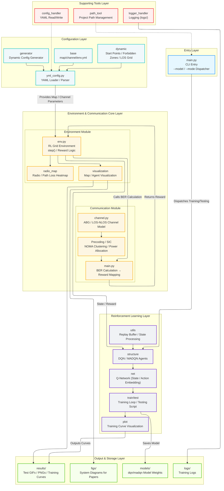

```mermaid

---
config:
  layout: elk
---
flowchart TB
 subgraph EntryLayer["Entry Layer"]
        A["main.py<br>CLI Entry<br>--model / --mode Dispatcher"]
  end
 subgraph ConfigLayer["Configuration Layer"]
    direction TB
        C4["yml_config.py<br>YAML Loader / Parser"]
        C3["generator<br>Dynamic Config Generator"]
        C2["dynamic<br>Start Points / Forbidden Zones / LOS Grid"]
        C1["base<br>map/channel/env.yml"]
  end
 subgraph EnvModule["Environment Module"]
    direction TB
        D3["visualization<br>Map / Agent Visualization"]
        D2["radio_map<br>Radio / Path Loss Heatmap"]
        D1["env.py<br>RL Grid Environment<br>step() / Reward Logic"]
  end
 subgraph CommModule["Communication Module"]
    direction TB
        E3["main.py<br>BER Calculation → Reward Mapping"]
        E2["Precoding / SIC<br>NOMA Clustering / Power Allocation"]
        E1["channel.py<br>ABG / LOS-NLOS Channel Model"]
  end
 subgraph EnvCommLayer["Environment & Communication Core Layer"]
    direction TB
        EnvModule
        CommModule
  end
 subgraph RLLayer["Reinforcement Learning Layer"]
    direction TB
        F4["plot<br>Training Curve Visualization"]
        F3["train/test<br>Training Loop / Testing Script"]
        F2["net<br>Q-Network (State / Action Embedding)"]
        F1["structure<br>DQN / MADQN Agents"]
        F5["utils<br>Replay Buffer / State Processing"]
  end
 subgraph SupportLayer["Supporting Tools Layer"]
    direction TB
        G3["path_tool<br>Project Path Management"]
        G2["config_handler<br>YAML Read/Write"]
        G1["logger_handler<br>Logging (logs/)"]
  end
 subgraph OutputLayer["Output & Storage Layer"]
    direction TB
        H4["figs/<br>System Diagrams for Papers"]
        H3["results/<br>Test GIFs / PNGs / Training Curves"]
        H2["models/<br>dqn/madqn Model Weights"]
        H1["logs/<br>Training Logs"]
  end
    C1 --> C4
    C2 --> C4
    C3 --> C4
    D1 --> D2 & D3
    E1 --> E2
    E2 --> E3
    D1 -- Calls BER Calculation --> E3
    E3 -- Returns Reward --> D1
    F5 --> F1
    F1 --> F2
    F2 --> F3
    F3 --> F4
    A -- Dispatches Training/Testing --> F1
    C4 -- Provides Map / Channel Parameters --> D1
    D1 -- State / Reward --> F1
    F3 -- Saves Model --> H2
    F4 -- Outputs Curves --> H3
    G1 --> H1
    D3 --> H3 & H4
    G2 -.-> C4
    G3 -.-> A

     A:::entry
     C1:::config
     C2:::config
     C3:::config
     C4:::config
     D1:::env_comm
     D2:::env_comm
     D3:::env_comm
     E1:::env_comm
     E2:::env_comm
     E3:::env_comm
     F5:::rl
     F1:::rl
     F2:::rl
     F3:::rl
     F4:::rl
     G1:::support
     G2:::support
     G3:::support
     H1:::output
     H2:::output
     H3:::output
     H4:::output
    classDef entry fill:#e6f7ff,stroke:#1890ff,stroke-width:2px
    classDef config fill:#f0f8fb,stroke:#13c2c2,stroke-width:2px
    classDef env_comm fill:#fdf6e3,stroke:#faad14,stroke-width:2px
    classDef rl fill:#f0f2f5,stroke:#722ed1,stroke-width:2px
    classDef support fill:#fef0f0,stroke:#f5222d,stroke-width:2px
    classDef output fill:#f6ffed,stroke:#52c41a,stroke-width:2px
```